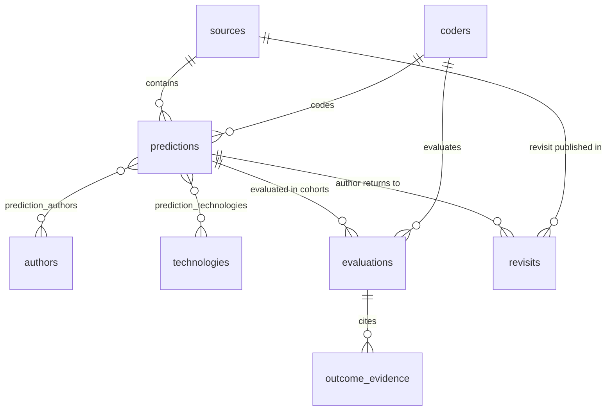

# Tech-Panic Tracker: Project Plan and Protocol Design

**Authors:** Jonathan Jayes, Ben Schneider
**Version:** 0.2 (draft for discussion — precedes preregistration; v0.2 incorporates the internal review round: claim types D9, outcome-based verdicts D10, stratified sampling D11, naive-baseline benchmark D12, estimand & prior-art sections, two-sided verdict bands, living-authors policy)
**Date:** 2026-08-03
**Status:** Living planning document. Sections marked **TO RESEARCH** are placeholders to be fleshed out before the relevant protocol is frozen. Once a protocol document in `protocol/` is registered on OSF, that document — not this one — is authoritative.

---

## Table of contents

1. [Project overview & research questions](#1-project-overview--research-questions)
2. [Repository structure](#2-repository-structure)
3. [Relational data model](#3-relational-data-model)
4. [Search protocol](#4-search-protocol)
5. [LLM-assisted extraction pipeline](#5-llm-assisted-extraction-pipeline)
6. [Evaluation protocol](#6-evaluation-protocol)
7. [Preregistration plan](#7-preregistration-plan)
8. [Analysis plan sketch](#8-analysis-plan-sketch)
9. [Phased roadmap](#9-phased-roadmap)
10. [Open science & licensing](#10-open-science--licensing)
11. [Risks & limitations register](#11-risks--limitations-register)

---

## 1. Project overview & research questions

### 1.1 Motivation

Predictions that technology will replace human labour are as old as industrialisation itself. From Luddite-era petitions against the power loom, through Keynes' "technological unemployment" (1930), Herbert Simon's claim that machines would be capable of any human work "within twenty years" (1960), Leontief's horses analogy (1983), Rifkin's *The End of Work* (1995), to Frey & Osborne's "47% of US employment at risk" (2013) and the current wave of generative-AI forecasts — economists, futurists, governments, intergovernmental organisations, and consultancies have repeatedly made bold, often quantified, claims about labour replacement.

Remarkably, no systematic, open dataset exists that (a) collects these predictions across the full historical span, (b) classifies them on a common scheme, and (c) evaluates them against outcome data over their stated horizons. This project builds that dataset — **Tech-Panic Tracker** — and uses it to ask what makes labour-replacement predictions accurate or inaccurate.

### 1.2 Primary research questions

- **RQ1 (descriptive):** What is the historical distribution of labour-replacement predictions — over time ("panic waves"), by technology, by author type, by level of aggregation, and by specificity?
- **RQ2 (evaluative):** Of the predictions whose horizons have elapsed, what share were correct, and to what degree (on a graded rubric)?
- **RQ3 (explanatory):** What features of a prediction predict its accuracy — horizon length, technology generality, author type, level of aggregation, whether a mechanism was specified, whether the claim was quantified?
- **RQ4 (behavioural):** Do authors ever return to their predictions — reaffirm, moderate, extend deadlines, or retract — and how does revisiting relate to accuracy?

### 1.3 Design decisions (confirmed 2026-08-03)

| # | Decision | Choice | Rationale |
|---|----------|--------|-----------|
| D1 | Inclusion criteria | Both quantitative forecasts **and** qualitative claims, tagged by a 4-level specificity tier (§3.5) | Pre-1900 material is rarely quantified; excluding it would gut the historical record. Tiering lets analyses filter without discarding data. |
| D2 | Coding workflow | LLM-assisted extraction with **100% human verification** of every record; prompts, pipeline, and reliability sampling preregistered | Scales the corpus while keeping the analytic dataset fully human-verified (§5). |
| D3 | Preregistration & outputs | OSF preregistration (two-stage, §7); outputs = open dataset (CSV + codebook) and an academic paper; public GitHub repo | Open-data principles; the evaluation stage is where researcher discretion lives, so it gets its own registration. |
| D4 | Language & period | English-language sources, ~1800 to present; non-English classics (Marx, Leontief originals, etc.) via published English translations | Reproducible search protocol; multilingual search is a documented limitation (§11). |
| D5 | Evaluation method | Graded ordinal verdict rubric (5 levels + 3 terminal codes), backed wherever possible by quantitative outcome data with cited evidence per verdict | Binary verdicts force coarse judgments; purely quantitative scoring drops most historical material (§6). |
| D6 | Data format | Plain UTF-8 CSVs + versioned codebook in git; schema-validated (frictionless Table Schema + pandera); DOI-minted releases via Zenodo/OSF | Maximum transparency, diff-ability, and machine-readability. |
| D7 | Search rigour | PRISMA-inspired hybrid: reproducible database search strings **plus** a documented snowball/expert-source track for grey literature | Strict PRISMA is infeasible for 19th-century newspapers and consultancy PDFs; the hybrid keeps both rigour and coverage (§4). |
| D8 | Project tooling | spec-kit workflow (`specify init` → constitution → `/specify` → `/plan` → `/tasks`); this document is the input to `/specify` | Treats the pipeline build as versioned, specified features. |
| D9 | Claim types | Exposure/"at risk" claims (Frey–Osborne, OECD) coded as a **separate `claim_type` track** with their own evaluation logic, distinct from employment-outcome predictions | Evaluating "47% at risk" as "47% will disappear" grades a claim the authors never made — the most predictable referee attack (§3.4, §6.6). |
| D10 | Verdict basis | Verdicts are **outcome-based**: did the predicted employment state occur in the stated locus/horizon, regardless of cause; attribution recorded only as an exploratory flag | Requiring causal attribution turns each verdict into a research project and floods `insufficient_evidence`; the limitation is stated openly (§6.3). |
| D11 | Search volume | Registered **stratified sampling** for oversized strata (random sample within stratum × year, sampling weights carried into analysis); Google Scholar & Google Books demoted to the snowball track | Modern strata return 10⁵+ hits; exhaustive screening is infeasible, and Scholar is irreproducible (personalised, capped, no API) (§4.1). |
| D12 | Benchmark | **Registered secondary analysis**: naive-baseline (persistence/trend-extrapolation) skill scores for quantified predictions | Some occupations decline in any 30-year window; without a benchmark, accuracy statistics are a gotcha list, not forecasting evaluation (§8.2). |

### 1.4 Scope statement

**Included:** any documented claim, published ~1800 or later in English (or English translation), that asserts a technology will cause a **reduction, elimination, or creation of human employment** — at any level from a single task or firm to the world economy — with at least an identifiable direction. Both alarmist and reassuring ("this technology will *not* destroy jobs" / "will create more jobs than it destroys") predictions are in scope; the `panic_valence` field distinguishes them, and including reassurances is essential for calibration analyses.

**Excluded:** claims purely about wages, inequality, working conditions, or the *nature* of work without an employment-quantity claim; fiction (unless quoted approvingly as a prediction by a non-fiction source); claims about technologies replacing *other technologies* with no stated employment consequence; retrospective statements ("the loom destroyed jobs") that make no forward-looking claim.

Boundary cases are governed by the codebook decision rules (§3.10) and logged in `docs/decisions/`.

### 1.5 Estimand

"All predictions ever made" is a collection goal, not a sampling frame. The corpus is necessarily a sample of the **surviving, digitised, English-language record as retrievable under the registered protocol** — and that is the population our statistics describe. The paper states this estimand explicitly and never claims coverage of the underlying discourse itself.

Two consequences are built into the design:

- **Denominators for "panic waves" (RQ1):** raw prediction counts over time confound panic with the growth of publishing. The registered time-series descriptive is a **normalised rate** — query hits per million digitised pages per archive-year (Ngram-style), using each archive's published volume counts — with raw counts reported alongside.
- **Retrieval probability varies by era** (OCR quality on 19th-century newsprint, vocabulary match). Mitigation: a **per-era recall validation** — a fixed random sample of archive pages per stratum is hand-read and the query miss rate estimated — reported alongside the time series (§4.1).

### 1.6 Related work & contribution

The contribution is a systematic, all-author-type, two-century, *evaluated*, open dataset. No existing resource combines those properties, but several neighbours must be positioned against and mined as sources:

> **RESEARCHED (2026-08-03)** — full inventory with verified citations in [docs/research/prior-art-and-positioning.md](research/prior-art-and-positioning.md). Highlights: Armstrong & Sotala's MIRI AI-predictions dataset is still downloadable and carries a documented coding error (a cautionary tale our verification-log design answers); Mokyr–Vickers–Ziebarth 2015 is the narrative we systematize ("they told the story; we build the sampling frame and keep score"); published retrospective evaluations of Frey–Osborne exist (Georgieff & Milanez OECD 2021; Coelli & Borland 2019; ITIF 2022) and validate our outcome-coding for that row; economics already institutionalizes forecast evaluation only for short-horizon macro (WEO/Timmermann, SPF, Loungani) — **nobody maintains a database of long-horizon structural predictions**; the Pessimists Archive is motivation + source leads, never data.

### 1.7 Positioning: economic historians writing for economists

The authors are economic historians; the target venue is an economics journal; the persuasion goal is demonstrating that systematic data collection and prediction evaluation is possible — and produces general-interest findings — outside applied microeconomics. Strategy (full venue analysis in [docs/research/prior-art-and-positioning.md](research/prior-art-and-positioning.md)):

1. **Companion data descriptor → *Scientific Data***: locks in the open, versioned, DOI'd identity of the dataset without spending the analytical result.
2. **Flagship → *AER: Insights*** (primary target), modeled on Kelly, Papanikolaou, Seru & Taddy (2021) "Measuring Technological Innovation over the Long Run" — proof the AER family accepts long-run text-based measurement + descriptive findings in ~6,000 words. Lead with one sharp finding. Tier 1.5 fallback: *Economic Journal* standard article.
3. **Backups:** *Explorations in Economic History* (explicit data/methods track — near-certain fit), *Journal of Economic History*; a separate rubric-methods paper to *International Journal of Forecasting*.
4. **Amplification:** later solicited JEP piece in the Mokyr et al. 2015 / Autor 2015 lineage.

Cover-letter line: the predictions that shape technology policy are long-horizon structural claims, so far evaluated only one at a time (Frey–Osborne retrospectives, Limits-to-Growth updates, UN population-forecast audits); this project generalizes that one-off genre into a database, the way Tetlock generalized pundit-checking into a science.

---

## 2. Repository structure

Spec-kit conventions plus a research-compendium layout:

```
tech-panic-tracker/
├── .specify/                    # created by `specify init --here` (Phase P0)
│   └── memory/constitution.md   # project principles (§9, P0)
├── specs/                       # spec-kit /specify outputs, one dir per feature
├── docs/
│   ├── PLAN.md                  # this document
│   ├── codebook.md              # versioned codebook (generated from data/vocab/)
│   ├── prisma-flow.md           # PRISMA-style flow accounting + generated diagram
│   └── decisions/               # ADR-style decision log (DR-001-inclusion.md, ...)
├── protocol/
│   ├── search-protocol.md       # §4 — frozen at Registration 1
│   ├── extraction-protocol.md   # §5 — frozen at Registration 1
│   ├── evaluation-rubric.md     # §6 — frozen at Registration 2
│   ├── prereg/                  # OSF registration drafts (reg1-protocol.md, reg2-analysis.md)
│   └── prompts/                 # versioned LLM prompts: detect_v1.md, extract_v1.md, ...
├── data/
│   ├── raw/                     # source PDFs/scans/text (or pointers; copyrighted files NOT in git)
│   ├── interim/                 # LLM draft extractions, pre-verification (never analysed)
│   ├── processed/               # canonical CSVs (§3) — the published dataset
│   ├── vocab/                   # controlled vocabularies as CSVs (technologies.csv, enums.csv)
│   └── logs/                    # search_log.csv, screening_log.csv, verification_log.csv
├── schemas/
│   └── datapackage.json         # frictionless Table Schema for every CSV (CI-validated)
├── pipeline/                    # Python package: ingest/, detect/, extract/, validate/
├── analysis/                    # numbered scripts 01_descriptives.py ... + figures/
├── tests/                       # schema tests, pipeline unit tests, prompt regression tests
├── CITATION.cff
├── LICENSE                      # MIT (code)
├── LICENSE-DATA                 # CC-BY 4.0 (data)
└── README.md
```

**Schema tooling:** `schemas/datapackage.json` (frictionless Data Package + Table Schema) is the canonical schema — it doubles as machine-readable metadata for Zenodo/OSF. `pipeline/validate/` adds pandera checks for cross-table rules frictionless cannot express: foreign-key integrity, "every ordinal verdict requires ≥1 evidence row", date logic (verified_date ≥ created_date), and status-transition rules. CI runs both on every commit touching `data/processed/`.

---

## 3. Relational data model

Nine tables, all plain UTF-8 CSV in `data/processed/`, snake_case columns, string primary keys with typed prefixes (`src_...`, `pred_...`, `eval_...`, ULID-style for sortability). Every enum lives in `data/vocab/enums.csv` (`enum_name, value, definition, added_version`) so `docs/codebook.md` is **generated**, not hand-maintained. Partial dates (`1930`, `1930-06`) are permitted where sources allow no better.

**Entity-relationship overview:**



### 3.1 `sources.csv`

One row per distinct document. Reprints/syndications collapse to one canonical source (§4.4).

| column | type | notes |
|---|---|---|
| `source_id` | string PK | |
| `title` | string | |
| `container_title` | string | journal / newspaper / publisher / report series |
| `pub_date` | partial date | `1930`, `1930-06`, or full date |
| `source_type` | enum | `journal_article, working_paper, book, book_chapter, government_report, igo_report, consultancy_report, think_tank_report, newspaper_article, magazine_article, speech_transcript, testimony, pamphlet, blog_post, other` |
| `venue_country` | ISO 3166-1 alpha-2 | |
| `language_original` | ISO 639-1 | `en`, or original language of a translated classic |
| `is_translation` | bool | |
| `url` | string, nullable | |
| `archive_url` | string | Wayback/HathiTrust/other permalink; **required whenever `url` is set** |
| `doi` | string, nullable | |
| `retrieval_track` | enum | `database, snowball, expert_source, pilot_seed` |
| `search_query_id` | FK → search_log, nullable | null for snowball/expert items |
| `parent_source_id` | FK → sources, nullable | snowball hop provenance |
| `duplicates_of` | FK → sources, nullable | set on reprints/syndications |
| `accessed_date` | date | |
| `full_text_location` | string | path under `data/raw/` or external pointer |
| `notes` | string | |

### 3.2 `authors.csv` and `prediction_authors.csv`

`authors.csv`:

| column | type | notes |
|---|---|---|
| `author_id` | string PK | |
| `display_name` | string | person or institution ("McKinsey Global Institute") |
| `author_type` | enum | `academic, government_agency, igo, consultancy, think_tank, journalist, futurist, industry_executive, labor_organization, politician, anonymous_institutional, other` |
| `orcid_or_viaf` | string, nullable | disambiguation ID where available |
| `notes` | string | |

`prediction_authors.csv` (junction): `prediction_id`, `author_id`, `author_role` enum = `sole, lead, coauthor, institutional`, **`author_type_at_prediction`** (same enum as `author_type`).

Institutional reports with no named author get an author row with the institution as `display_name` and the appropriate `author_type`. Because a person's role changes over a career (an academic who becomes a consultant), the type used in analyses is **`author_type_at_prediction` on the junction table** — coded as of the prediction date; `authors.author_type` records only the canonical/most-associated type and is never used in H3.

### 3.3 `technologies.csv` (controlled vocabulary) and `prediction_technologies.csv`

| column | type | notes |
|---|---|---|
| `tech_id` | string PK | slug, e.g. `power_loom`, `atm`, `electricity`, `industrial_robot`, `expert_system`, `generative_ai` |
| `label` | string | display name |
| `generality` | enum | `narrow, domain, general_purpose` — **three levels**, not two: many technologies (e.g. "computers in banking", industrial robotics) sit between the ATM and electricity |
| `parent_tech_id` | self-FK, nullable | hierarchy, e.g. `generative_ai → artificial_intelligence → computing` |
| `first_commercial_year` | int, nullable | enables "prediction made N years after introduction" analyses |
| `definition` | string | scope note used by coders |
| `vocab_version` | string | version at which entry was added |

`prediction_technologies.csv` (junction): `prediction_id`, `tech_id`, `is_primary` bool (exactly one primary per prediction).

The vocabulary is **append-only after Registration 1**; every addition is logged in `docs/decisions/`.

### 3.4 `predictions.csv` — the core table

One row per distinct prediction. A source may yield 0..n predictions. The same author restating the same claim later is a **revisit** (§3.8), not a new prediction, unless the substance changes (decision rule in codebook).

| column | type | notes |
|---|---|---|
| `prediction_id` | string PK | |
| `source_id` | FK → sources | |
| `quote_verbatim` | string | **exact quoted text, mandatory** |
| `quote_locator` | string | page number, column, URL fragment, or timestamp — **mandatory** |
| `prediction_date` | partial date | when uttered/published (may precede `pub_date` for speeches) |
| `claim_summary` | string | one-sentence neutral paraphrase |
| `claim_type` | enum | `employment_outcome` (jobs will be lost/created), `exposure_risk` ("X% of jobs are at risk/susceptible" — Frey–Osborne-style), `capability_milestone` ("machines will be able to do Y") — **each type has its own evaluation logic (§6.6); they are never pooled in accuracy statistics** |
| `level` | enum | `task, firm, occupation, industry, country_region, global` |
| `geography` | string | ISO 3166 codes, `;`-separated, or `GLOBAL` |
| `geography_text` | string, nullable | historical region as stated ("the Lancashire cotton districts") when no ISO code fits; `geography` then carries the best modern mapping |
| `occupation_code` | string, nullable | code in the system below |
| `occupation_system` | enum | `soc2018, hisco, none` |
| `industry_code` | string, nullable | |
| `industry_system` | enum | `naics2022, sic1987, none` |
| `direction` | enum | `displacement, creation, net_negative, net_positive, transformation_neutral, ambiguous` |
| `magnitude_type` | enum | `percent_of_jobs, absolute_jobs, share_of_tasks, qualitative_total, qualitative_partial, none` |
| `estimate_type` | enum | `point, range, scenario_conditional, none` — McKinsey-style "400–800 million" is `range`, not a point forecast |
| `magnitude_value` | float, nullable | point estimate, or null when `estimate_type = range` |
| `magnitude_low` | float, nullable | lower bound of a stated range/scenario |
| `magnitude_high` | float, nullable | upper bound |
| `magnitude_headline` | float, nullable | the single number the author/institution promoted publicly (often the scary endpoint of a range) — evaluated separately per §6.3 |
| `magnitude_unit` | string, nullable | |
| `specificity_tier` | enum | see §3.5 |
| `horizon_stated_text` | string, nullable | verbatim, e.g. "within a generation" |
| `horizon_type` | enum | `explicit_year, explicit_duration, vague_phrase, conditional, none` |
| `horizon_start_year` | int, nullable | usually = year of `prediction_date` |
| `horizon_end_year` | int, nullable | operationalised per §6.2 where vague |
| `horizon_operationalized` | bool | true whenever a §6.2 default rule was applied |
| `mechanism_specified` | bool | |
| `mechanism_text` | string, nullable | verbatim mechanism claim |
| `mechanism_type` | enum, nullable | `cost_substitution, capability_parity, scale_speed, deskilling, demand_shift, other` |
| `is_conditional` | bool | "unless we retrain workers…" |
| `panic_valence` | enum | `alarm, reassurance, neutral_forecast` |
| `is_secondary_report` | bool | prediction reported secondhand (newspaper quoting an economist); author = the predictor, source = the reporting outlet |
| `primary_source_status` | enum | `primary_located, secondary_only, not_chased` — the chase-the-primary rule lives in the codebook |
| `derived_from_prediction_id` | FK → predictions, nullable | **citation lineage**: set when the estimate derives from an upstream study — e.g. Deloitte 2014, PwC 2017, WDR 2016, and ILO ASEAN 2016 all derive from Frey–Osborne 2013 and are not independent predictions (see `docs/research/institutional-publishers.md`) |
| `extraction_method` | enum | `llm_assisted, human_manual` |
| `llm_model` | string, nullable | e.g. `claude-fable-5` |
| `llm_prompt_version` | string, nullable | e.g. `extract_v2` |
| `created_by` | FK → coders | `llm` or coder_id |
| `created_date` | date | |
| `verified_by` | FK → coders, nullable | **required before `record_status = verified`** |
| `verified_date` | date, nullable | |
| `record_status` | enum | `draft, verified, locked, deprecated` |

### 3.5 Specificity tiers

| tier | name | definition | example |
|---|---|---|---|
| `T1_quantified` | Fully quantified | Explicit magnitude **and** explicit horizon | "ATMs will eliminate 30% of teller jobs by 1995" |
| `T2_semi_quantified` | Semi-quantified | Magnitude **or** horizon explicit, not both | "47% of US employment is at high risk of computerisation" (magnitude, no firm date) |
| `T3_directional` | Directional | Clear direction and locus, no numbers | "The power loom will throw the hand-weavers out of work within our lifetime" |
| `T4_rhetorical` | Rhetorical | Vague alarm or reassurance, no operationalizable claim | "Machinery threatens the very existence of the labouring classes" |

### 3.6 `evaluations.csv`

| column | type | notes |
|---|---|---|
| `evaluation_id` | string PK | |
| `prediction_id` | FK → predictions | |
| `verdict` | enum | see §3.7 |
| `verdict_rationale` | string | **required free text**; must reference the operationalised claim and the cited evidence, not the author's reputation |
| `resolution_year_used` | int | year at which outcome was measured |
| `evaluated_as_of` | date | fixed evaluation cohort, e.g. `2026-12-31`; future cohorts (2031, …) add new rows rather than editing old ones |
| `evaluator_id` | FK → coders | |
| `second_evaluator_id` | FK → coders, nullable | set for the 20% reliability subsample |
| `second_verdict` | enum, nullable | independent verdict from second evaluator |
| `blinding_status` | enum | `blinded, partially_blinded, unblindable` |
| `evaluator_confidence` | enum | `high, medium, low` |
| `attribution_confidence` | enum | `high, medium, low, not_assessed` — evaluator's judgment that the technology drove the outcome; **exploratory only**, never gates a verdict (§6.3) |
| `reading_defaulted` | bool | true when the gross-vs-net default reading was applied (§6.3) |
| *(provenance block as in §3.4)* | | created/verified/status fields |

### 3.7 Verdict scale

Five ordinal levels plus three terminal codes:

| code | ordinal | meaning |
|---|---|---|
| `clearly_correct` | 5 | direction, rough magnitude, and timing all borne out |
| `mostly_correct` | 4 | direction correct; magnitude or timing off by ≤ one rubric band (§6.3) |
| `mixed` | 3 | partially realised — e.g. the occupation shrank, but via attrition/transformation rather than the claimed mechanism or scale |
| `mostly_wrong` | 2 | direction weakly wrong, or magnitude off by > one band |
| `clearly_wrong` | 1 | direction contradicted, or the claimed outcome plainly did not occur within the horizon |
| `too_early_to_tell` | — | horizon extends beyond the evaluation cohort (§6.4) |
| `unfalsifiable` | — | no operationalizable claim even after §6.2 defaults (mostly T4) |
| `insufficient_evidence` | — | falsifiable, but no adequate outcome data found (the data search is logged) |

### 3.8 `revisits.csv`

Answers RQ4: did the author ever return to the prediction?

| column | type | notes |
|---|---|---|
| `revisit_id` | string PK | |
| `prediction_id` | FK → predictions | |
| `revisit_source_id` | FK → sources | where the revisit appeared |
| `revisit_date` | partial date | |
| `revisit_stance` | enum | `reaffirmed, moderated, deadline_extended, retracted, reversed, silent_contradiction` |
| `quote_verbatim` | string | |
| `quote_locator` | string | |
| *(provenance block)* | | |

`silent_contradiction` = the author later wrote something incompatible with the prediction without acknowledging it.

**Institutional serials rule:** when an institution updates its numbers in a later edition of the same series (e.g. WEF *Future of Jobs* 2018 revising 2016 figures), the new edition is coded as a **new prediction** (the substance changed) *plus* a linked revisit row on the original (stance = `moderated`, `reaffirmed`, etc.). This keeps both the revision behaviour (RQ4) and the new claim evaluable.

### 3.9 `outcome_evidence.csv`

| column | type | notes |
|---|---|---|
| `evidence_id` | string PK | |
| `evaluation_id` | FK → evaluations | |
| `evidence_type` | enum | `official_statistics, census_series, industry_association, academic_study, news_retrospective, other` |
| `dataset_name` | string | e.g. `BLS_OES`, `BLS_CES`, `IPUMS_USA`, `UK_Census_occupational` |
| `series_or_table_id` | string | |
| `citation` | string | full citation |
| `url` | string | |
| `value_summary` | string | e.g. "US bank tellers: 484k (1990) → 527k (2007) → 364k (2023)" |
| `covers_years` | string | e.g. `1990-2023` |
| `notes` | string | |

**Validation rules:** every ordinal verdict requires ≥1 evidence row; `clearly_correct` / `clearly_wrong` verdicts require ≥1 row of type `official_statistics`, `census_series`, or `academic_study`.

### 3.10 `coders.csv` and logs

`coders.csv`: `coder_id`, `name`, `role` enum = `pi, ra, llm`. Initial roster: Jonathan Jayes (`pi`), Ben Schneider (`pi`), plus one row per LLM model/prompt configuration used. With two PIs, the human–human double-coding in §5.3 and the second-evaluator subsample in §6.5 are performed by the two authors coding independently.

Logs in `data/logs/` (schema in §4.3 and §5.4): `search_log.csv`, `screening_log.csv`, `verification_log.csv`.

The **codebook** (`docs/codebook.md`, generated from `data/vocab/`) additionally carries the prose decision rules coders apply: the inclusion rule (§1.4), the revisit-vs-new-prediction rule, boundary-case examples, and coding walkthroughs for two or three landmark predictions.

---

## 4. Search protocol

Full protocol lives in `protocol/search-protocol.md`, frozen at Registration 1. Two tracks.

### 4.1 Track A — systematic database search

Reproducible query strings, frozen at preregistration, run per database and logged. Query design crosses two term blocks:

- **Technology-terms block** (era-specific): "labour-saving machinery", "mechanisation", "automatic machinery", "automation", "computerisation", "robots", "artificial intelligence", …
- **Displacement-terms block**: "technological unemployment", "displace labour", "thrown out of work", "superfluous workmen", "end of work", "jobs at risk", "job losses", …

Because vocabulary drifts sharply over two centuries, queries are **stratified into five era strata**, each with era-appropriate terms:

| stratum | period | characteristic vocabulary |
|---|---|---|
| E1 | 1800–1870 | "machinery question", "labour-saving machinery", "distress of the operatives" |
| E2 | 1870–1920 | "mechanisation", "displacement of labour", "the machine age" |
| E3 | 1920–1955 | "technological unemployment", "automation" (from ~1947), "push-button factory" |
| E4 | 1955–1995 | "automation", "cybernation", "computers and jobs", "robotics" |
| E5 | 1995–present | "computerisation", "AI", "machine learning", "jobs at risk of automation" |

**Candidate databases** (final list + exact strings frozen at Reg 1): JSTOR, EconLit, HathiTrust full-text, Chronicling America (LoC API), ProQuest Historical Newspapers, Internet Archive. Era-appropriate date filters per stratum. **Google Scholar and Google Books are demoted to the Track B toolkit** — Scholar is personalised, capped at 1,000 results, and has no API, so it cannot anchor a reproducible search; both remain useful for snowballing and locating full texts.

Every run appends to `data/logs/search_log.csv`: `query_id, track, database, query_string, filters, date_run, n_results, n_exported, exporter`.

**Volume management — registered stratified sampling.** Modern strata (E4–E5 especially) will return result volumes far beyond screenable capacity. Rules:

1. The **pilot (P1) measures per-database yield** for every draft query — feasibility numbers go into the search protocol before Reg 1.
2. Any stratum × database cell whose yield exceeds a registered **screening cap (e.g. 2,000 hits — final value set from pilot capacity data)** is screened on a **simple random sample within stratum × year**, drawn with a seeded, scripted procedure.
3. Sampling probabilities are stored per source, and **sampling weights propagate into every corpus-level statistic** (§8); unweighted results reported as robustness.
4. Cells under the cap are screened exhaustively.

**Per-era retrieval validation.** Because OCR quality and vocabulary match vary by era (→ retrieval probability confounds the RQ1 time series, §1.5), a fixed random sample of archive pages per stratum is hand-read and the query **miss rate estimated per era**; these recall estimates are published with the panic-wave series.

### 4.2 Track B — snowball & expert sources (grey literature)

Databases index consultancy reports, IGO publications, and government studies poorly. Track B, documented to **PRISMA-S** conventions:

1. **Seed set** = pilot landmark predictions (§4.6) + the institutional publisher inventory (§4.5).
2. **Citation chasing**: forward + backward, **maximum 2 generations** per seed, every hop recorded via `parent_source_id`.
3. **Publisher sweeps**: for each institution in the inventory, enumerate the relevant publication series (e.g. every *WEF Future of Jobs* edition) and screen all editions — logged as `expert_source`.

### 4.3 Screening stages

- **S1 — title/snippet screen**: include/exclude; on exclusion record `exclusion_reason` enum = `no_prediction, not_labor_replacement, out_of_scope_language, out_of_period, duplicate, inaccessible`.
- **S2 — full-text screen**: same enum + `prediction_confirmed`.
- **S3 — extraction**: one included source yields 0..n prediction records (a source can pass S2 yet yield 0 predictions on close reading — this is logged, not silently dropped).

Each stage appends to `data/logs/screening_log.csv`: `screening_id, source_id, stage, decision, exclusion_reason, screener_id, date`.

**Screening reliability:** a random **10% of S1 and S2 decisions are dual-screened** independently by the second author; disagreement rates reported, disagreements resolved by discussion and logged. (PRISMA expects dual screening or a declared single-screener limitation — this is the middle path, stated in Reg 1.)

**Reported-speech rule:** when a source *reports* someone else's prediction ("Professor X told the *Times* that…"), the prediction's author is the predictor, the source is the reporting outlet, `is_secondary_report = true`, and the primary source is chased (one documented attempt); `primary_source_status` records the result. Where primary and secondary versions differ, the primary governs.

### 4.4 Deduplication

- **Source-level**: syndicated/reprinted text → one canonical source; reprints get `duplicates_of`. Fuzzy text matching (e.g. rapidfuzz) proposes candidates; a human decides.
- **Prediction-level**: same author restating the same claim later → coded as a **revisit** of the original prediction, not a new prediction — *unless* the substance changes (different magnitude, horizon, technology, or level), in which case it is a new prediction linked by a note. The exact decision rule lives in the codebook.

### 4.5 PRISMA-style flow accounting

`docs/prisma-flow.md` renders a flow diagram adapted for this project, with counts generated from the logs (never hand-typed):

- Two identification columns: Track A (per-database counts) and Track B (per-hop counts).
- A merged deduplication node.
- S1 and S2 exclusion boxes with per-reason counts.
- A final **unit-change node** — "N sources included → M predictions extracted" — non-standard for PRISMA but necessary because the unit of analysis changes from source to prediction.

> **RESEARCHED (2026-08-03) — institutional publisher inventory:** [docs/research/institutional-publishers.md](research/institutional-publishers.md). 21 institutions with series names, edition lists, access terms, flagship claims, and URLs. Operational findings: weforum.org and bls.gov 403-block bots (manual/Playwright needed); BLS is the only institution with a formal self-evaluation program (our methodological template); Forrester/Gartner headline numbers recoverable from free press releases; **Frey–Osborne 2013 is the upstream parent of the Deloitte/PwC/WDR-2016/ILO-ASEAN estimates → `derived_from_prediction_id` lineage field added (§3.4)**.

> **RESEARCHED (2026-08-03) — historical archives & access terms:** [docs/research/archives-and-apis.md](research/archives-and-apis.md), with live trial queries. Key results: the legacy Chronicling America API is dead (loc.gov JSON API replaces it); JSTOR's Constellate was sunset 2025-07; HathiTrust has no search API (8,226 live UI hits for "technological unemployment") but HTRC Extracted Features + Google Ngram v3 exports are fixed downloadable datasets = strongest reproducibility; **GovInfo/Congressional Record (604 live hits, earliest 21 Feb 1928 — pre-dating Keynes) and UK Hansard (79 hits, keyless API) join as first-class registered sources**. Database roster revised in `protocol/search-protocol.md`; full API-key checklist compiled.

> **RESEARCHED (2026-08-03) — landmark prediction seed list:** [docs/research/landmark-seed-list.md](research/landmark-seed-list.md). 46 verified items spanning all five eras (Ned Ludd 1812 → Amodei 2025), 11 reassurance-side, ~12 T1-quantified (WEF 2020 and Hinton 2016 already scoreable today), each with verification URLs; plus an **apocryphal-quote hazard list** (Bennis factory-and-dog is fake; Reuther/Ford robots-buy-cars is folklore; Simon is 1960, not 1965) wired into `protocol/extraction-protocol.md`. Remaining gaps: E2 (1870–1920) thinnest; three items need primary verbatim confirmation (Douglas 1930, Lederer 1938, Nora-Minc 30% figure).

> **RESEARCHED (2026-08-03) — outcome-data inventory:** [docs/research/outcome-data-inventory.md](research/outcome-data-inventory.md). Headlines: IPUMS OCC1950 is the 1850–present US workhorse (breaks at 1940, 1970/80 modeled not ignored); **BLS's own warning: OEWS is not usable as a time series** (levels only; CPS/census for trends); the full HISCO↔OCC1950↔OCC2010↔SOC2018 crosswalk chain exists in published files; four named BLS self-evaluation articles (Veneri 1997; Rosenthal 1999; Alpert & Auyer 2003; Byun et al. 2015) are the H6 naive-benchmark template; registrations to start now: IPUMS, BLS API, UKDS (Eurostat microdata is the slow one).

---

## 5. LLM-assisted extraction pipeline

Full protocol in `protocol/extraction-protocol.md`, frozen at Registration 1.

### 5.1 Pipeline stages

Only humans move records past `draft`.

| stage | actor | description |
|---|---|---|
| 1. Ingest | pipeline | Normalise full text; OCR where needed; log OCR engine + a per-document quality flag |
| 2. Candidate detection | LLM (prompt `detect_vN`) | Flag passages containing candidate labour-replacement predictions; tuned for **high recall** (false positives are cheap — a human discards them; false negatives are silent). Output: candidate spans + confidence |
| 3. Structured extraction | LLM (prompt `extract_vN`) | Fill a JSON object mirroring `predictions.csv`, JSON-schema-constrained, with **mandatory verbatim quote + locator** (hallucinated quotes fail verification by construction) |
| 4. Human verification | human coder | Every record reviewed against the source text; every field-level correction logged; status → `verified` |
| 5. Lock | pipeline + human | After schema validation + dedup pass, status → `locked`. Locked records are immutable; corrections happen via a new row plus `deprecated` on the old one |

### 5.2 Prompt & model versioning

- Prompts are files in `protocol/prompts/` with versioned names (`detect_v1.md`, `extract_v2.md`).
- Every record stores `llm_model` + `llm_prompt_version`; `llm_model` records the **exact dated snapshot ID** returned by the API, never a floating alias — aliases move and would silently break the regression set.
- A **frozen regression set of ~25 documents** (spanning eras and source types) is re-run whenever a prompt or model changes; output diffs are reviewed before adoption.
- Prompt/model changes after Registration 1 require a logged amendment (§7.3).

### 5.3 Reliability design (preregistered)

Because every record is human-verified, LLM performance is a **workload/quality metric, not a validity threat**. The preregistration states this framing explicitly:

> "LLM output is treated as a first-draft suggestion; the analytic dataset consists solely of human-verified records. We report LLM-draft agreement for transparency, and human–human agreement as the validity statistic."

- **LLM–human agreement:** computed per field from `verification_log.csv` (share of fields unchanged at verification; Gwet's AC1 or Krippendorff's α for categorical fields). Reported in the paper's methods section.
- **Human–human reliability:** independent double-coding by two humans on a random **20% of predictions (minimum n = 100)**; **Krippendorff's α per field** (handles missing data and >2 coders); target **α ≥ 0.80**; any field below **0.667** triggers codebook revision and re-coding of that field across the corpus.
- **Detection recall check:** a random sample of ~30 included sources is fully hand-read to estimate the candidate-detection miss rate; reported as a limitation statistic.

### 5.4 `verification_log.csv`

`log_id, record_id, table, field, llm_value, human_value, changed (bool), coder_id, date`. This log is published with the dataset — full transparency about what the LLM got wrong.

---

## 6. Evaluation protocol

Full protocol in `protocol/evaluation-rubric.md`, **frozen at Registration 2 — before any verdict is assigned** (§7). This is where researcher discretion is most dangerous, so it gets the strictest treatment.

### 6.1 Matching predictions to outcome data

Priority order per prediction:

1. **Direct series match** via `occupation_code`/`industry_code`: BLS OES/OEWS and CES, decennial census occupational series (IPUMS OCC1950), UK census occupational series. Historical occupations coded in HISCO, modern in SOC 2018, joined via crosswalks (TO RESEARCH item, §4).
2. **Academic retrospectives** (peer-reviewed studies of the specific technology/occupation episode).
3. **Industry statistics** (associations, regulatory filings).
4. **Documented failure**: if none adequate, verdict = `insufficient_evidence`, and the failed data search is logged.

Notes: `resolution_year_used` snaps to the nearest data-availability year (census decades for pre-1940 material) and the snap is recorded. Task-level claims (`level = task`, `share_of_tasks`) will often lack outcome series entirely; we expect and disclose a high `insufficient_evidence` rate for them rather than stretching evidence.

### 6.2 Horizon operationalisation defaults (preregistered lookup table)

| stated phrase class | default horizon from `prediction_date` |
|---|---|
| "soon", "in the near future", "shortly", "imminent" | 10 years |
| "within a generation" | 30 years |
| "in our lifetime(s)" | 40 years |
| "by the end of the century / the decade" | literal |
| explicit duration or year | literal |
| "eventually", "someday", "in the long run" | no horizon → `unfalsifiable`; **exception:** if the magnitude is explicit, apply a 50-year convention and flag for sensitivity analysis |

`horizon_operationalized = true` marks every defaulted case; all analyses run with and without defaulted horizons (§8.3).

### 6.3 Verdict decision rules

**Verdicts are outcome-based (decision D10):** the question is whether the predicted employment state occurred in the stated locus and horizon — **not** whether the named technology caused it. Requiring causal attribution would make every verdict a research project and flood `insufficient_evidence`; instead, an exploratory `attribution_confidence` field (`high, medium, low, not_assessed`) on `evaluations.csv` records the evaluator's judgment of whether the technology was plausibly the driver, used only in exploratory analyses. The gross-vs-net trap is acknowledged head-on: a gross-displacement claim is evaluated against the claim's own terms where discernible; where ambiguous, the default reading is **net employment in the stated locus** (the reading outcome data can actually test), flagged `reading_defaulted = true`. Bessen's bank tellers — ATM-era predictions of teller decline while tellers *grew* for decades — is the codebook's worked example.

**Denominator rule for "X% of jobs" claims:** evaluated against the employment stock **at the horizon year** (the claim's natural reading), preregistered; sensitivity using the prediction-year stock reported.

**Quantified claims (T1/T2):** compute the ratio *r* = realised magnitude / claimed magnitude at `horizon_end_year`. Bands are **two-sided and symmetric in log space** — over-realisation is also a miss of magnitude (a prediction of 100k jobs lost is not "clearly correct" if 400k were lost):

| ratio *r* (realised/claimed) | verdict |
|---|---|
| 2/3 ≤ *r* ≤ 3/2 | `clearly_correct` |
| 0.4 ≤ *r* < 2/3, or 3/2 < *r* ≤ 2.5 | `mostly_correct` |
| 0.1 ≤ *r* < 0.4, or 2.5 < *r* ≤ 10, or right direction but wrong locus (adjacent occupation displaced) | `mixed` |
| *r* < 0.1 or *r* > 10, direction not contradicted | `mostly_wrong` |
| direction contradicted (e.g. predicted decline, observed growth) | `clearly_wrong` |

Band edges are stress-tested in the pilot and frozen at Reg 2.

**Range/scenario claims (`estimate_type = range`):** the claim is correct at the level implied by where the outcome lands relative to the stated interval — inside the range → `clearly_correct`; within the `mostly_correct` band of the nearer endpoint → `mostly_correct`; and so on, using the nearer endpoint as the reference magnitude. The `magnitude_headline` number is additionally scored under the point-estimate rules as a **registered secondary outcome** — institutions do not get credit for ranges wide enough to be unfalsifiable while promoting the alarming endpoint.

**Timing slack (registered sensitivity):** all quantified verdicts are recomputed with the outcome measured at `horizon_end_year + 25%` of horizon length — a prediction realised a few years late is informative about timing bias, and the main/slack comparison is reported.

**Directional claims (T3):** correct direction with material observed change → capped at `mostly_correct` (**T3 can never earn `clearly_correct`** — otherwise vague predictions would be structurally accuracy-inflated relative to brave quantified ones); no material change → `mostly_wrong`; direction contradicted → `clearly_wrong`.

**Rhetorical claims (T4):** `unfalsifiable`, unless §6.2 defaults rescue an operationalizable core.

"Material change" and locus rules get worked examples in `protocol/evaluation-rubric.md`, stress-tested in the pilot.

### 6.4 Too-early logic (first cohort: 2026)

- `horizon_end_year` > cohort year (2026) → `too_early_to_tell`, **except** early resolution: the outcome is already fully realised (→ `clearly_correct`) or the claim logically requires a milestone already missed (→ `clearly_wrong`).
- Predictions with ≥ 50% of horizon elapsed may receive an **exploratory "trajectory note"** — explicitly non-ordinal, excluded from registered analyses.
- `evaluated_as_of` supports future re-evaluation cohorts (2031, 2036, …) as new evaluation rows — the dataset is designed as a **living instrument**: today's generative-AI predictions become evaluable in later cohorts without rewriting history.

### 6.5 Blinding & hindsight-bias mitigation

Full blinding is infeasible — famous quotes identify their authors. Protocol:

- Evaluators receive a **redacted evaluation packet**: `claim_summary`, `level`, `geography`, occupation/industry codes, horizon, magnitude — author, venue, and verbatim quote masked.
- Evaluator records `blinding_status` honestly (`blinded / partially_blinded / unblindable`); landmark items will be `unblindable`.
- Registered robustness check: verdict distributions by `blinding_status`.
- **Second-evaluator subsample:** independent verdicts on 20% of evaluations; **weighted κ** (quadratic weights) on the ordinal scale reported.
- Every verdict must cite evidence rows, and the rationale must reference the operationalised claim — never the author's reputation.

### 6.6 Exposure-risk and capability claims (decision D9)

`claim_type` determines the evaluation logic; the three tracks are **never pooled** in accuracy statistics.

- **`employment_outcome`** — the rubric above (§6.2–6.4).
- **`exposure_risk`** ("X% of jobs are at high risk of automation"): the claim is about *susceptibility*, not realised job loss, so the test is **differential**: over the horizon, did occupations the source classed as high-exposure decline (in employment or growth rate) relative to low-exposure occupations? This requires the source to publish an occupation-level exposure ranking (Frey–Osborne and OECD do); verdicts use the same ordinal scale applied to the differential claim. Sources giving only an aggregate exposure number with no ranking are `unfalsifiable` on this track — recorded, not graded as displacement forecasts.
- **`capability_milestone`** ("machines will be able to do Y by year Z"): evaluated on whether the capability materialised commercially by the horizon (evidence: adoption data, technical retrospectives), *not* on employment. These verdicts feed the exploratory question of whether capability optimism or the capability→employment link is where predictions fail.

---

## 7. Preregistration plan

### 7.1 Two-stage registration on OSF

| | Registration 1 — Collection & coding protocol | Registration 2 — Evaluation & analysis plan |
|---|---|---|
| **Timing** | After the pilot (P1), **before** the full systematic search (P3) | After collection is locked (end P4), **before any verdict is assigned** (P5) |
| **Template** | OSF *Generalized Systematic Review Registration*; fall back to open-ended *OSF Prereg* if it fits poorly | *OSF Prereg* (secondary-data variant) |
| **Registers** | Search strings & databases, era strata, screening criteria & exclusion enums, full schema + codebook v1.0, extraction pipeline + prompt versions, reliability sampling plan & thresholds | Verdict rubric & decision rules, horizon-default table, too-early logic, evidence-source priority, blinding procedure, full analysis plan (§8) |

Registration 2 is the credibility-critical one: collection is largely descriptive, but **evaluation is where a motivated researcher could steer results**. Registering the rubric before seeing any verdict removes that degree of freedom.

### 7.2 Registered vs exploratory

All §8 H-labelled tests and registered descriptives are confirmatory. Explicitly exploratory: trajectory notes, panic-wave periodisation choices, anything using `evaluator_confidence`, and any analysis added after Registration 2 (labelled as such in the paper).

### 7.3 Amendments policy

- After Reg 1: codebook/vocabulary changes via OSF transparent amendments + `docs/decisions/` entries; vocabulary is append-only.
- After Reg 2: **no amendment to the rubric after the first verdict** without reporting results under both pre- and post-amendment rules.

---

## 8. Analysis plan sketch

> Hypotheses below are illustrative directional forms, **to be confirmed/refined by the PIs before Registration 2**.

**Primary outcome:** binary *directionally correct* (verdict ∈ {`clearly_correct`, `mostly_correct`} vs {`mixed`, `mostly_wrong`, `clearly_wrong`}); the full ordinal scale is the secondary outcome. **Framing:** given a plausibly modest evaluable N (150–400 quantified predictions), H1–H5 are framed as **estimation with 95% confidence intervals**, not null-hypothesis tests; a pilot-informed **precision analysis** (what CI width the expected N buys per contrast) goes into Reg 2, with minimum-N gates below which a contrast is reported as descriptive only. **Multiplicity:** H1–H5 form a small pre-specified family; Benjamini–Hochberg within the family; robustness analyses are never treated as independent confirmations. **Weights:** all corpus-level statistics use the §4.1 sampling weights; unweighted versions as robustness. Analyses on the `employment_outcome` track only, unless a hypothesis names another track.

### 8.1 Registered descriptives

- Prediction volume over time, by technology, level, and `panic_valence` — the "panic waves" series, reported as **normalised rates** (hits per million digitised archive pages, §1.5) with raw counts alongside.
- Distributions of specificity tier, level, author type, mechanism specification.
- Verdict distribution overall and by stratum; `insufficient_evidence` and `unfalsifiable` rates reported as outcomes, never dropped.
- Revisit rates and stance distribution: how often do predictors reaffirm, extend deadlines, or retract?

### 8.2 Hypotheses (confirmatory)

- **H1 (horizon):** P(`clearly/mostly_correct`) decreases with horizon length. Ordinal logit: verdict ~ log(horizon) + era + tier controls.
- **H2 (generality):** predictions about `general_purpose` technologies are less accurate than predictions about `narrow` technologies.
- **H3 (author type):** academics and government agencies outperform futurists and consultancies (pre-specified pairwise contrasts and ordering).
- **H4 (mechanism):** predictions specifying a mechanism are more accurate than those that don't.
- **H5 (magnitude calibration):** among T1 quantified displacement claims, mean(realised/claimed magnitude) < 1 — systematic overestimation — with a calibration curve of claimed vs realised shares.
- **Survival analysis:** Kaplan–Meier time-to-resolution by tier and author type, with `too_early_to_tell` as right-censoring.
- **H6 (skill vs naive baseline — registered secondary, decision D12):** for each evaluable quantified prediction, construct a naive counterpart forecast of the same outcome series (persistence, and linear trend extrapolated from the 10 years preceding the prediction) and score it under the identical rubric bands. Report the share of predictions that beat their naive baseline, overall and by author type/era — the forecasting-skill result that distinguishes this project from a list of gotchas. Predictions whose series lack 10 years of pre-history get persistence only, flagged.

### 8.3 Registered robustness suite

Re-run headline analyses: excluding operationalised-horizon defaults; excluding `unblindable` evaluations; collapsing the 5-point scale to 3; with era fixed effects; with standard errors clustered on `author_id` (same author's predictions are not independent); by `retrieval_track` (Track A vs Track B accuracy — a direct check on snowball salience bias); **excluding derivative predictions** (`derived_from_prediction_id` set) so one upstream methodology (Frey–Osborne) is not counted five times.

---

## 9. Phased roadmap

Mapped to the spec-kit workflow; each pipeline build is a spec-kit feature (`/specify` → `/plan` → `/tasks`).

| phase | name | key work | exit criteria |
|---|---|---|---|
| **P0** | Foundations | `specify init --here`; write the **constitution** (principles below); repo scaffold per §2; `datapackage.json` + CI validation; merge project context into CLAUDE.md | Constitution merged; CI green on empty CSVs |
| **P1** | Pilot | `/specify` the schema + pipeline; hand-collect **30–50 landmark predictions** (§4 seed list) spanning all five eras; run the full pipeline end-to-end **including ~10 trial evaluations**; stress-test enums, horizon defaults, and rubric bands; **run every draft query and measure per-database yields** (feeds the §4.1 screening cap and sampling design); revise schema freely | Codebook v1.0; ≥1 schema revision cycle completed; pilot human–human α computed; rubric worked examples written; yield table per stratum × database |
| **P2** | Preregister I | Finalise `search-protocol.md` + `extraction-protocol.md`; file OSF Registration 1 | Reg 1 timestamped |
| **P3** | Systematic search & screening | Track A (with stratified sampling where capped) + Track B; S1/S2 screening incl. 10% dual-screened sample; per-era retrieval validation; PRISMA accounting | `screening_log` complete; recall estimates per era; included-source corpus frozen |
| **P4** | Extraction & verification | LLM pipeline + 100% human verification; 20% double-coding; reliability report | All records `locked`; α ≥ thresholds (or codebook-revision loop documented) |
| **P5** | Preregister II + Evaluation | File OSF Registration 2; evaluations + evidence collection; second-evaluator subsample | Every prediction has a verdict or terminal code |
| **P6** | Analysis & paper | Registered analyses; exploratory clearly separated; paper draft | `analysis/` reproduces end-to-end from `data/processed/` |
| **P7** | Release | Dataset v1.0.0 tag; Zenodo DOI; OSF links; announcement | DOI minted; CITATION.cff final |

**The pilot deliberately precedes preregistration** so that schema and rubric changes are cheap and honest — this sequencing is stated openly in the registrations (reviewers regard piloting-before-registering as good practice, not a weakness).

**Constitution principles (P0), drafted:**
1. Every published record is human-verified; nothing in `data/interim/` is ever analysed.
2. Every row carries full provenance (who/what coded it, when, from which prompt version).
3. `locked` records are immutable; corrections create new rows and deprecate old ones.
4. All vocabulary and codebook changes are logged decisions; vocabularies are append-only after Reg 1.
5. Verdicts cite evidence; rationale references the operationalised claim, never the author's reputation.
6. Counts in flow diagrams and the paper are generated from logs, never hand-typed.

---

## 10. Open science & licensing

- **Data:** CC-BY 4.0 (`LICENSE-DATA`). **Code:** MIT (`LICENSE`). **Prose/codebook:** CC-BY 4.0.
- `CITATION.cff` covering the dataset and, later, the paper.
- **Versioning:** semver on the data package — major = schema break, minor = new records, patch = corrections. Git tags → GitHub Releases → **Zenodo GitHub integration**: a DOI per release plus a concept DOI. OSF project links registrations and the Zenodo DOI.
- **Copyright constraint:** raw copyrighted full texts stay out of the public repo — `data/raw/` holds open-licence texts and *pointers/locators* for everything else. Short verbatim quotes in `predictions.csv` rely on fair use/fair dealing; quote lengths kept minimal.
- The `verification_log` (LLM error log) and all screening/search logs are published with the dataset.
- **Living-authors policy:** the project publicly grades claims made by named, living people and institutions. Stated policy: (1) verdicts attach to *claims*, never to persons; (2) every verdict ships with its full evidence and rationale; (3) a public correction channel (GitHub issues) feeds the deprecation mechanism — disputed verdicts are re-examined under the registered rubric and the exchange is logged; (4) before the v1.0 release, living authors (or institutions) with graded predictions are offered a courtesy notification and right of reply, published alongside the verdict if they choose.
- **Conflicts of interest & funding:** a COI and funding statement is maintained in the README and the paper; neither author has an interest in any graded institution — to be re-attested at each release.

---

## 11. Risks & limitations register

| # | risk | effect | mitigation |
|---|---|---|---|
| R1 | **Survivorship & digitisation bias** — surviving/digitised sources over-represent elite, urban, English publications; retrieval probability varies by era (OCR, vocabulary) | Historical corpus skews; panic-wave series partly measures retrieval | Era-stratified queries; per-era recall validation (§4.1); normalised rates with archive-volume denominators (§1.5); explicit estimand framing |
| R2 | **Snowball salience bias** — famously *wrong* predictions are what gets cited | Accuracy estimates biased downward in Track B | Track A provides the systematic backbone; accuracy reported separately by `retrieval_track` (§8.3) |
| R3 | **Hindsight bias in verdicts** | Verdicts contaminated by knowing how history went | Preregistered rubric bands (Reg 2 before first verdict); redacted packets; evidence-citation requirement; weighted-κ second-coder subsample |
| R4 | **English-only scope** | Non-Anglophone discourse (much 19th-c. material is German/French) unobserved | Stated limitation; translated classics included; no claims made about non-Anglophone discourse |
| R5 | **LLM extraction bias** — systematic misreading, quote hallucination | Corrupted records | 100% human verification; mandatory verbatim quote + locator (hallucinations fail verification); field-level correction log published |
| R6 | **Outcome-data availability correlated with era and verdict** | `insufficient_evidence` non-random | Reported as an outcome, never dropped; registered missingness analysis |
| R7 | **Non-independence** — same author, same panic wave | Overstated precision | Clustered SEs on author; era fixed effects; revisit-vs-new-prediction dedup rule |
| R8 | **Horizon-operationalisation discretion** | Researcher degrees of freedom | Preregistered default table (§6.2); `horizon_operationalized` flag; robustness excluding defaulted horizons |
| R9 | **Copyright on quotes/full texts** | Legal exposure; reproducibility friction | Short quotes under fair use; full texts as locators; archive permalinks |
| R10 | **Scope drift** — "replacing labour" vs "changing labour" | Inconsistent inclusion | Codebook inclusion rule: claim must assert reduction/elimination/creation of human employment attributable to a technology; `transformation_neutral` captures boundary cases; boundary decisions logged |
| R11 | **Claim-type misreading** — grading exposure/"at risk" claims as displacement forecasts | Evaluating claims the authors never made; the most predictable referee attack | `claim_type` field with separate, never-pooled evaluation tracks (§6.6) |
| R12 | **Disputes from graded living authors/institutions** | Reputational conflict, legal noise, pressure to soften verdicts | Living-authors policy (§10): claims not persons, evidence published per verdict, public correction channel, right of reply before v1.0 |
| R13 | **Low statistical power for confirmatory contrasts** | Uninterpretable nulls on H2/H3 | Estimation-with-CIs framing, pilot-informed precision analysis, minimum-N gates in Reg 2 (§8) |

---

*Status 2026-08-03 (evening): P0 complete — spec-kit initialized, constitution ratified (`.specify/memory/constitution.md`), repo scaffolded, schema (`schemas/datapackage.json`) + vocab drafts + protocol drafts written; all four §4 research items plus prior-art/positioning researched into `docs/research/`. Open decisions for the authors are tracked in [docs/OPEN-QUESTIONS.md](OPEN-QUESTIONS.md). Next: P1 pilot.*
